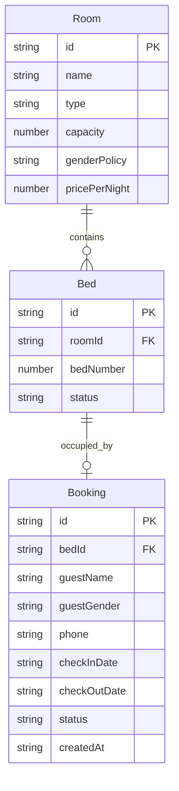

# 青旅/民宿床位预订管理系统 - 技术架构文档

## 1. 架构设计

```mermaid
flowchart TD
    "UI层" --> "状态管理层(Zustand)"
    "状态管理层" --> "本地存储层(localStorage)"
    "UI层" --> "组件层"
    "组件层" --> "预订模块"
    "组件层" --> "管理模块"
    "组件层" --> "通用组件"
```

纯前端单页应用，无后端服务，数据全部存储在浏览器 localStorage 中。

## 2. 技术说明
- **前端框架**: React 18 + TypeScript + Vite
- **样式方案**: Tailwind CSS 3
- **状态管理**: Zustand（轻量级，适合纯前端应用）
- **路由方案**: React Router DOM
- **图标库**: Lucide React
- **数据持久化**: localStorage（浏览器本地存储）
- **初始化工具**: vite-init (react-ts 模板)

## 3. 路由定义
| 路由 | 用途 |
|------|------|
| / | 预订页面（首页，房间列表+床位选择+预订表单） |
| /admin | 管理页面（入住名单+房间状态+配置管理） |

## 4. 数据模型

### 4.1 数据模型关系图


### 4.2 TypeScript 类型定义

```typescript
// 性别类型
type Gender = 'male' | 'female';

// 性别政策（房间入住限制）
type GenderPolicy = 'male_only' | 'female_only' | 'mixed';

// 床位状态
type BedStatus = 'available' | 'booked' | 'occupied';

// 预订状态
type BookingStatus = 'pending' | 'checked_in' | 'cancelled';

// 房间类型
type RoomType = 'dorm_4' | 'dorm_6' | 'dorm_8' | 'private';

// 房间实体
interface Room {
  id: string;
  name: string;
  type: RoomType;
  capacity: number;
  genderPolicy: GenderPolicy;
  pricePerNight: number;
}

// 床位实体
interface Bed {
  id: string;
  roomId: string;
  bedNumber: number;
  status: BedStatus;
}

// 预订记录实体
interface Booking {
  id: string;
  bedId: string;
  roomId: string;
  guestName: string;
  guestGender: Gender;
  phone: string;
  checkInDate: string;
  checkOutDate: string;
  status: BookingStatus;
  createdAt: string;
}

// 全局状态
interface AppState {
  rooms: Room[];
  beds: Bed[];
  bookings: Booking[];
  selectedDate: string;
  genderFilter: Gender | 'all';
  // Actions
  addBooking: (booking: Omit<Booking, 'id' | 'createdAt'>) => void;
  cancelBooking: (id: string) => void;
  checkIn: (id: string) => void;
  addRoom: (room: Omit<Room, 'id'>) => void;
  setGenderFilter: (filter: Gender | 'all') => void;
  setSelectedDate: (date: string) => void;
  getAvailableBeds: (roomId: string, date: string) => Bed[];
  getMatchingBeds: (guestGender: Gender, date: string) => Bed[];
}
```

### 4.3 初始数据
系统预置示例数据：
- 4人间男生房 x1（橙光男生四人间）
- 4人间女生房 x1（星语女生四人间）
- 6人间混住房 x1（晚风混住六人间）
- 大床房（私人）x1（望月大床房）

## 5. 核心模块设计

### 5.1 状态管理 (store)
- 使用 Zustand 创建全局 store
- 包含 rooms、beds、bookings 三个主要数据集合
- 提供 CRUD 操作方法
- 自动同步到 localStorage

### 5.2 拼房匹配逻辑
- 当用户选择性别偏好时，过滤出符合条件的房间/床位
- 当房间性别政策为 mixed 时，检查已预订人员性别：
  - 如果房间已有女性预订者，提示男性用户
  - 如果房间已有男性预订者，提示女性用户
- 性别政策为 male_only / female_only 的房间严格限制
- 私人房(privates)不受拼房限制

### 5.3 组件结构
```
src/
├── components/
│   ├── Layout.tsx              # 整体布局与导航
│   ├── RoomCard.tsx            # 房间卡片组件
│   ├── BedGrid.tsx             # 床位网格布局组件
│   ├── BedItem.tsx             # 单个床位组件
│   ├── BookingModal.tsx        # 预订弹窗表单
│   ├── AdminStats.tsx          # 管理端统计卡片
│   ├── BookingTable.tsx        # 入住名单表格
│   └── RoomStatusBoard.tsx     # 房间状态看板
├── pages/
│   ├── BookingPage.tsx         # 预订页面
│   └── AdminPage.tsx           # 管理页面
├── store/
│   └── useStore.ts             # Zustand 状态管理
├── types/
│   └── index.ts                # TypeScript 类型定义
├── utils/
│   ├── storage.ts              # localStorage 工具函数
│   └── mockData.ts             # 初始模拟数据
└── App.tsx
```

### 5.4 本地存储策略
- 存储键名：`hostel_booking_data`
- 存储内容：包含 rooms、beds、bookings 的完整数据对象
- 初始化时读取 localStorage，若无数据则写入初始 mock 数据
- 每次数据变更自动持久化到 localStorage
