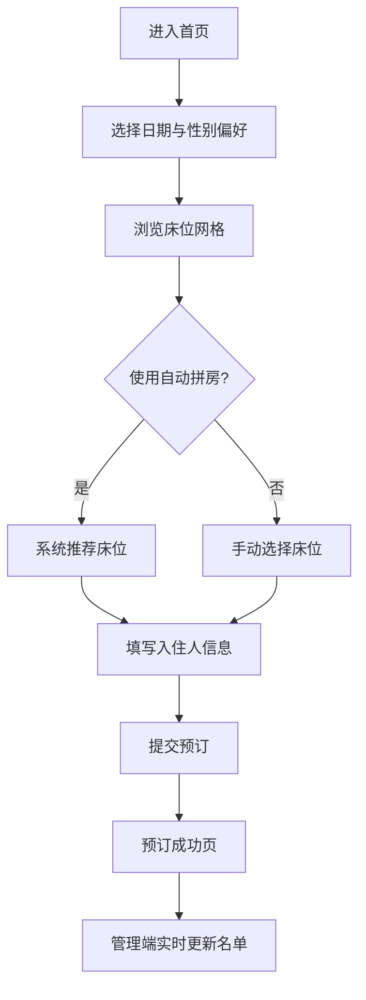

## 1. 产品概述
一款面向小型青旅/民宿的床位级在线预订管理系统，支持床位选择、多人混住拼房与性别偏好筛选。
- 解决传统青旅按房售卖、性别混住信息不透明、入住名单难以实时同步的问题，目标用户为青旅运营者与背包客旅客。
- 通过本地存储实现零后端、轻量化部署，让小型业主免运维即可上线在线预订。

## 2. 核心功能

### 2.1 用户角色
| 角色 | 注册方式 | 核心权限 |
|------|---------|---------|
| 旅客 | 免注册（填写姓名/性别即可下单） | 浏览床位、按性别偏好筛选、选择床位、确认预订 |
| 管理员 | 系统内固定入口（密码：admin） | 查看入住名单、管理房型与床位、清空数据 |

### 2.2 功能模块
本预订管理系统由以下页面组成：
1. **首页（旅客端）**：日期选择、性别偏好筛选、房型与床位实时网格、自动拼房推荐、预订表单。
2. **预订成功页**：订单详情、床位编号、入住人信息确认。
3. **管理端**：实时入住名单、按房间/床位的占用看板、统计数据（剩余床位、男女比例）、数据管理。

### 2.3 页面详情
| 页面名称 | 模块名称 | 功能描述 |
|---------|---------|---------|
| 首页 | 日期选择器 | 选择入住与离店日期，动态计算可用床位 |
| 首页 | 性别偏好筛选 | 提供"仅同性混住 / 男生间 / 女生间 / 不限"四种偏好；自动隐藏不匹配房间 |
| 首页 | 房间床位网格 | 卡片化展示每间房（容量、当前性别、剩余床位），床位以icon可视化（空闲/已占/选中） |
| 首页 | 自动拼房推荐 | 输入人数后系统自动选择最合适的相邻床位（同房间优先，同性别房优先），可一键采用 |
| 首页 | 预订表单 | 输入姓名、性别、手机号；提交后写入localStorage并生成订单号 |
| 预订成功页 | 订单详情 | 展示订单号、床位编号、入住时间、注意事项 |
| 管理端 | 登录入口 | 简单密码校验（admin）进入管理界面 |
| 管理端 | 入住名单 | 实时显示当日入住旅客（姓名、性别、床位号、入住/离店时间），支持删除/退订 |
| 管理端 | 占用看板 | 按房间维度展示床位占用情况，颜色标识男/女/空 |
| 管理端 | 统计卡片 | 总床位、已占用、空闲、男女比例 |
| 管理端 | 数据管理 | 重置示例数据、清空所有订单 |

## 3. 核心流程

旅客主流程：进入首页 → 选择日期与性别偏好 → 浏览/选择床位（或采用自动拼房推荐）→ 填写入住人信息 → 提交预订 → 查看订单结果。
管理员流程：进入管理端 → 输入密码 → 查看实时入住名单与床位看板 → 必要时退订/重置数据。

## 4. 用户界面设计

### 4.1 设计风格
- **主色**：深墨绿 #1F4D3F（自然/旅居感），辅色橘 #F2A65A（温暖灯光），背景米白 #F5F1E8。
- **按钮风格**：圆角 12px，主按钮带阴影微动效；次按钮线框。
- **字体**：标题使用 "Fraunces"（衬线，杂志感），正文使用 "Manrope"（无衬线，现代）；尺寸 14/16/20/28/40。
- **布局风格**：左右分栏（左侧筛选/订单摘要，右侧床位网格），卡片化房间展示，顶部固定导航。
- **图标/Emoji**：使用 lucide-react 图标 + 床位用 🛏 / 🟢 / 🔴 状态点；性别用 ♂♀ 符号。

### 4.2 页面设计概览
| 页面名称 | 模块名称 | UI 元素 |
|---------|---------|---------|
| 首页 | 顶部导航 | 米白底 + 墨绿 logo "Hostel Hive"，右上角"管理端"入口 |
| 首页 | 房间卡片 | 圆角16px 卡片，房间名 + 容量徽章 + 床位 icon 网格 4列；hover 微浮起 |
| 首页 | 床位 icon | 24px 床型图，空闲=墨绿描边 / 已占=灰填充 / 选中=橘色填充+脉冲 |
| 首页 | 预订摘要 | 右侧 sticky 卡片，显示已选床位、价格、入住天数、确认按钮 |
| 管理端 | 统计卡片 | 4 个卡片横排（总数/已占/空闲/男女比），数字大字号 Fraunces |
| 管理端 | 名单表格 | 斑马纹行，性别用色块徽章，操作列含"退订"按钮 |

### 4.3 响应式
桌面优先；窗口 < 900px 时筛选栏折叠为可展开抽屉，房间卡片网格变为单列；按钮触控区域 ≥ 44px。
