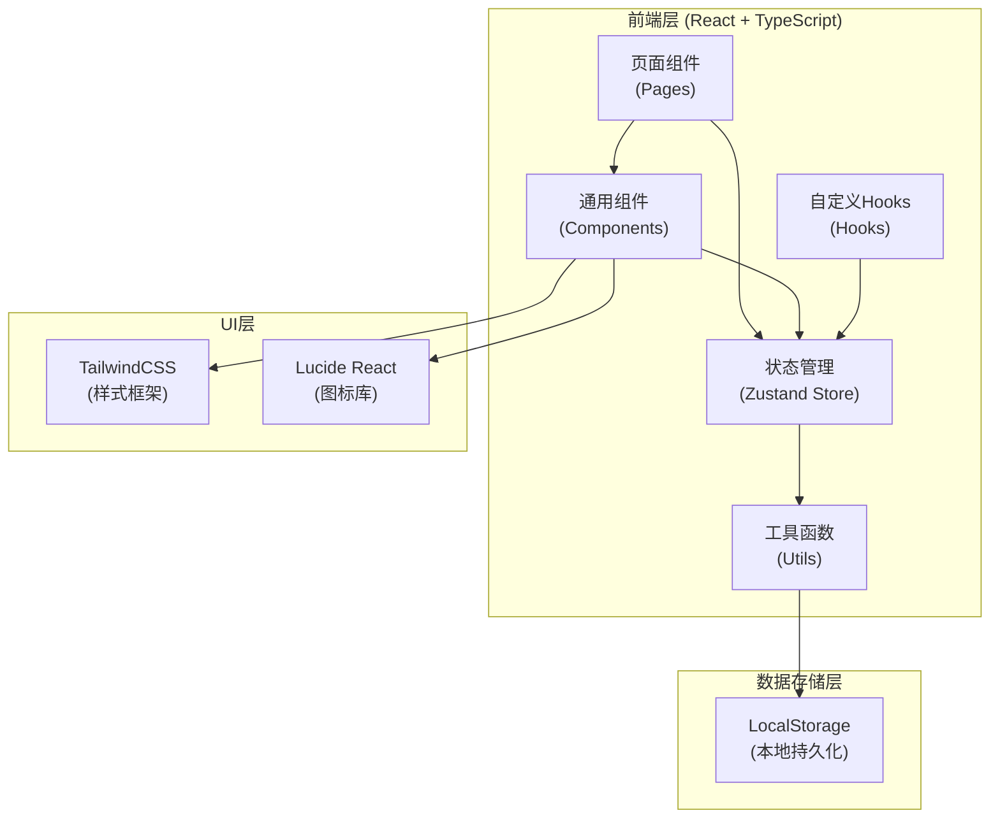
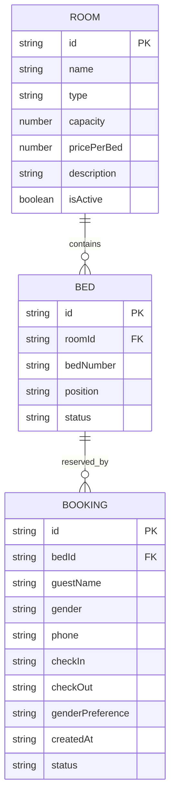

# 青旅民宿床位预订管理系统 - 技术架构

## 1. 架构设计

本系统采用纯前端单页应用架构，无需后端服务，所有数据通过浏览器 LocalStorage 进行持久化存储。



## 2. 技术栈说明

- **前端框架**: React 18 + TypeScript
- **构建工具**: Vite
- **样式方案**: TailwindCSS 3
- **状态管理**: Zustand（轻量级状态管理）
- **路由方案**: React Router DOM
- **图标库**: Lucide React
- **数据存储**: 浏览器 LocalStorage
- **初始化工具**: vite-init (react-ts 模板)

## 3. 路由定义

| 路由路径 | 页面组件 | 功能说明 |
|----------|----------|----------|
| `/` | 预订大厅 (BookingHall) | 旅客预订主页面，房间展示、床位选择、预订提交 |
| `/admin` | 管理后台 (AdminDashboard) | 管理员视图，统计概览、房间管理、入住名单 |

## 4. 数据模型

### 4.1 数据模型定义



### 4.2 TypeScript 类型定义

```typescript
// 性别类型
type Gender = 'male' | 'female';

// 性别偏好类型
type GenderPreference = 'male_only' | 'female_only' | 'any';

// 房间类型
type RoomType = 'dorm_male' | 'dorm_female' | 'dorm_mixed' | 'private';

// 床位位置
type BedPosition = 'upper' | 'lower';

// 床位状态
type BedStatus = 'available' | 'booked' | 'selected' | 'maintenance';

// 预订状态
type BookingStatus = 'confirmed' | 'cancelled' | 'checked_in' | 'checked_out';

// 房间接口
interface Room {
  id: string;
  name: string;
  type: RoomType;
  capacity: number;
  pricePerBed: number;
  description: string;
  isActive: boolean;
}

// 床位接口
interface Bed {
  id: string;
  roomId: string;
  bedNumber: string;
  position: BedPosition;
  status: BedStatus;
}

// 预订接口
interface Booking {
  id: string;
  bedId: string;
  roomId: string;
  guestName: string;
  gender: Gender;
  phone: string;
  checkIn: string;
  checkOut: string;
  genderPreference: GenderPreference;
  createdAt: string;
  status: BookingStatus;
}

// 统计数据接口
interface Statistics {
  todayCheckIns: number;
  totalBookings: number;
  occupancyRate: number;
  availableBeds: number;
}
```

### 4.3 LocalStorage 存储结构

| Key | 数据类型 | 说明 |
|-----|----------|------|
| `hostel_rooms` | `Room[]` | 房间列表数据 |
| `hostel_beds` | `Bed[]` | 床位列表数据 |
| `hostel_bookings` | `Booking[]` | 预订记录数据 |
| `hostel_initialized` | `boolean` | 初始数据是否已加载 |

## 5. 项目目录结构

```
src/
├── components/          # 通用组件
│   ├── RoomCard.tsx     # 房间卡片组件
│   ├── BedLayout.tsx    # 床位布局组件
│   ├── BedItem.tsx      # 单个床位组件
│   ├── BookingForm.tsx  # 预订表单组件
│   ├── Navbar.tsx       # 导航栏组件
│   ├── StatCard.tsx     # 统计卡片组件
│   └── GuestList.tsx    # 入住名单组件
├── pages/               # 页面组件
│   ├── BookingHall.tsx  # 预订大厅页面
│   └── AdminDashboard.tsx # 管理后台页面
├── store/               # Zustand状态管理
│   └── useBookingStore.ts # 预订状态store
├── types/               # TypeScript类型定义
│   └── index.ts         # 类型定义文件
├── utils/               # 工具函数
│   ├── storage.ts       # LocalStorage工具
│   ├── matching.ts      # 智能拼房匹配算法
│   └── mockData.ts      # 初始模拟数据
├── hooks/               # 自定义Hooks
│   └── useStatistics.ts # 统计数据计算hook
├── App.tsx              # 应用主组件
├── main.tsx             # 应用入口
└── index.css            # 全局样式
```

## 6. 核心算法说明

### 6.1 智能拼房匹配算法

1. **性别偏好优先**：根据旅客性别偏好，筛选符合条件的房间
2. **同性别聚集**：优先推荐已有相同性别入住的床位（形成性别聚集区）
3. **相邻床位推荐**：多人同时预订时优先推荐相邻的上下铺
4. **利用率均衡**：优先填充已有入住的房间，提高整体入住率

### 6.2 床位状态计算

- 根据当前日期与预订的入住/离店日期动态计算床位状态
- 实时统计每个房间的可用床位数量
- 计算入住率等统计指标
