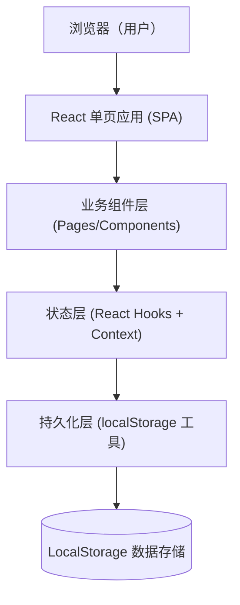
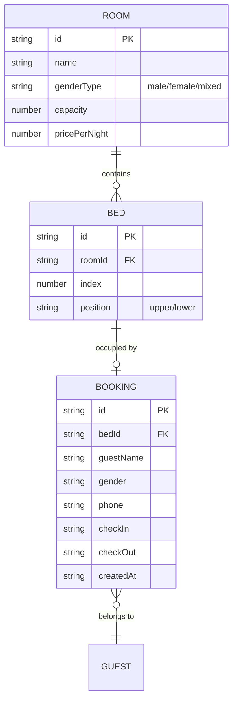

## 1. 架构设计

## 2. 技术描述
- 前端：React@18 + TypeScript + Tailwindcss@3 + Vite@5
- 路由：react-router-dom@6（首页 / 预订成功 / 管理端）
- 图标：lucide-react
- 状态：React useState/useReducer + Context（无需 Redux）
- 后端：无
- 数据存储：浏览器 localStorage（封装为 storage 工具模块）

## 3. 路由定义
| 路由 | 用途 |
|------|------|
| / | 旅客端首页：床位浏览、筛选、预订 |
| /booking-success | 预订成功页，展示订单详情 |
| /admin | 管理端，查看入住名单与占用看板 |

## 4. 数据模型

### 4.1 数据模型定义

### 4.2 LocalStorage Key 定义
| Key | 数据 | 说明 |
|-----|------|------|
| hostel.rooms | Room[] | 初始化时写入示例房间 |
| hostel.beds | Bed[] | 初始化时写入示例床位 |
| hostel.bookings | Booking[] | 实时读写预订数据 |
| hostel.admin.token | string | 管理端登录态 |

### 4.3 初始示例数据（伪代码）
- 4 间房：男生间 6 床、女生间 6 床、混住间 4 床、家庭间 4 床
- 价格 80~150 元/晚
- 默认 0 条预订
