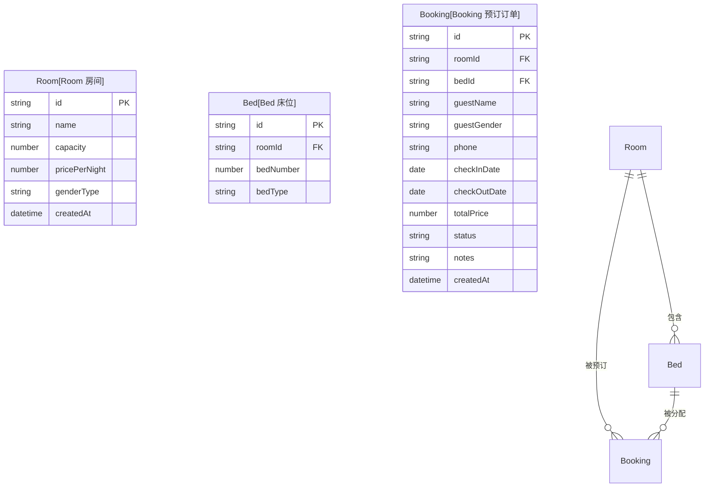

# 青旅/民宿床位预订管理系统 - 技术架构文档

## 1. 架构设计

```mermaid
flowchart TD
    "UI层[UI展示层<br/>React组件]" --> "状态管理层[状态管理层<br/>React Hooks + Context]"
    "状态管理层" --> "数据持久层[数据持久层<br/>localStorage封装]"
    "数据持久层" --> "类型定义[TypeScript类型定义]"
    "业务逻辑层[业务逻辑层<br/>拼房匹配/床位计算]" --> "状态管理层"
```

纯前端单页应用，无后端服务，所有数据通过浏览器 localStorage 持久化。

## 2. 技术说明
- **前端框架**：React 18 + TypeScript (.tsx)
- **构建工具**：Vite 6
- **样式方案**：Tailwind CSS 3
- **图标库**：lucide-react
- **路由方案**：React Router DOM v6
- **状态管理**：React Context + useReducer 轻量状态
- **数据存储**：浏览器 localStorage（本地持久化）
- **初始化工具**：create-vite（React + TypeScript模板）
- **后端**：无（纯前端应用）
- **数据库**：无（使用 localStorage 模拟数据存储）

## 3. 路由定义
| 路由路径 | 页面用途 |
|----------|----------|
| `/` | 首页预订页，房型展示和床位预订功能 |
| `/admin` | 管理后台页，入住名单和预订管理 |

## 4. 数据模型

### 4.1 数据模型关系图


### 4.2 TypeScript 数据类型定义
```typescript
// 房间性别限制类型
type GenderRestriction = 'female-only' | 'male-only' | 'mixed';

// 预订状态
type BookingStatus = 'confirmed' | 'cancelled' | 'checked-in' | 'checked-out';

// 住客性别
type Gender = 'female' | 'male';

// 房间
interface Room {
  id: string;
  name: string;
  capacity: number;
  pricePerNight: number;
  genderRestriction: GenderRestriction;
  description?: string;
}

// 床位
interface Bed {
  id: string;
  roomId: string;
  bedNumber: number;
  bedType: 'upper' | 'lower'; // 上铺/下铺
}

// 预订订单
interface Booking {
  id: string;
  roomId: string;
  bedId: string;
  guestName: string;
  guestGender: Gender;
  phone: string;
  checkInDate: string;
  checkOutDate: string;
  totalPrice: number;
  status: BookingStatus;
  notes?: string;
  createdAt: string;
}
```

### 4.3 localStorage 存储键定义
| 键名 | 数据类型 | 说明 |
|------|----------|------|
| `hostel_rooms` | `Room[]` | 房间列表配置 |
| `hostel_beds` | `Bed[]` | 床位列表 |
| `hostel_bookings` | `Booking[]` | 所有预订订单 |

### 4.4 初始示例数据
- 初始化3个房间：女生4人间、男生4人间、混住6人间
- 自动为每个房间生成对应数量的床位（上铺/下铺交替）
- 内置少量示例预订数据用于演示拼房功能

## 5. 项目目录结构
```
src/
├── types/              # 类型定义
│   └── index.ts
├── utils/              # 工具函数
│   ├── storage.ts      # localStorage 封装
│   ├── date.ts         # 日期处理工具
│   └── roomMatcher.ts  # 拼房匹配逻辑
├── context/            # Context状态
│   └── BookingContext.tsx
├── components/         # 可复用组件
│   ├── Header.tsx
│   ├── RoomCard.tsx
│   ├── BedMap.tsx
│   ├── BookingModal.tsx
│   └── GenderFilter.tsx
├── pages/              # 页面组件
│   ├── BookingPage.tsx
│   └── AdminPage.tsx
├── data/               # 初始数据
│   └── seed.ts
├── App.tsx             # 路由配置
├── main.tsx            # 入口
└── index.css           # Tailwind入口+全局样式
```

## 6. 核心业务逻辑
1. **床位可用性计算**：根据所选日期范围，查询该时间段内已预订的床位，标记不可选
2. **性别匹配规则**：
   - 女生房：只可预订性别为女的客人
   - 男生房：只可预订性别为男的客人
   - 混住房：不限制性别，显示当前同房客人性别构成
3. **拼房提示**：选中床位时显示该房间同日期段已入住客人性别和数量
4. **价格计算**：房价 × 入住天数 = 总价
